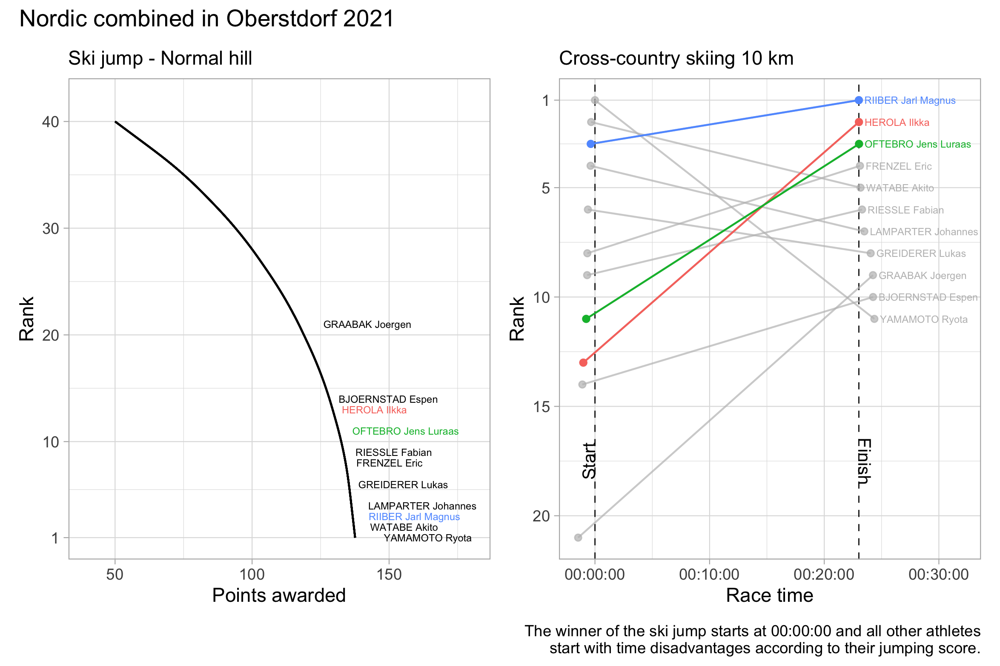

# Nordic World Ski Championships 2021

The FIS Nordic World Ski Championship is a nordic ski event organized by the International Ski Federation (FIS). The event takes place every two years, and includes three of the disciplines in nordic skiing: cross-country skiing, ski jumping and nordic combined.

In 2021 the ski event was held in Oberstdorf, between February 25 and March 7. 
This was the 42nd edition, and the third time Oberstdorf hosts the world championship.

This repository will contain some visualizations from the event, mostly the cross-country ski races. The visualizations are made with ggplot2.

### Cross-country skiing events

#### Sprint
Sprint races are short distance races that begins with a qualification round and progress to knock-out heats, where skiers are eliminated from the race. The qualification round starts as an interval start where the 30 fastest skiers qualify for the sprint's quarterfinals, also called heats. 

There are 5 quarterfinals, with 6 skiers in each heat. The first two skiers across the finish line in each heat advance to the semifinals. Additionally, the two fastest times among the skiers who did not finish among the top two of their respective heats, qualify for the semifinal as 'lucky losers'. That makes for 12 skiers in the semifinals. In a similar pattern the 6 best skiers in the semifinals advance to the final. In the final,
the first skier to cross the line will be crowned overall sprint winner.

Below is a graphical recap of the sprint. The x-axis is kept fixed to make it easier to compare speed between the heats. Notice the speed in the first two quarterfinals compared to the other quarterfinals. In the graph you can also see the strong performance of the Norwegian team, highlighted in red.

#### Skiathlon
Skiathlon combines the classic technique and the skate technique in one race. The race starts in classique technique. In the mid of the race, the racers change skis at a transition area, and continue the rest of the race in the skating technique. The men's race is 30 km in total distance, while the women's race is 15 km.

A graphical recap of the skiathlon can be found below. Here you can follow the progress of the 10 fastest skiers in the race.

#### 15 km Interval Start free
In interval starts, the skiers start one-by-one, typically separated with 30-second intervals. The skier with the fastest time wins.

In Oberstdorf the interval start distance was in free technique, which means that all techniques are allowed. Since skating is the faster technique, the skiers will choose to skate.

In the graph below you can find the top 5 fastest skiers at different stages of the race. In addition you can find the top 5 overall fastest skiers in the table at the bottom of the last panel. The upper dots in each panel shows the fastest skier in that segment. The horizontal position of the dots show which of the skiers that have the best total time at that moment. 

### Nordic combined
Nordic combined is a sport that combines ski jumping and cross-country skiing. The athletes usually start with the ski jump competition. Later on the same day, the cross-country race takes place. The results of the ski jumping part of the race are used to determine the starting order for the cross-country part of the race.
The winner of the ski jumping competition starts at 00:00:00, followed by one athlete at a time, each starting after a time delay according to their jump score. The athlete to first cross the finish line of the cross-country part of the race is declared the winner.

Below is a graphical recap of the Normal hill / 10.0 km competition in Oberstdorf. Here you can follow the ski jump score and cross-country race for the top 11 athletes. 11 was chosen to include the overall performance for the winner of the ski jump. 

The first graph simulates the ski jump results, where the curve represents the hill. The athlete with most points, evaluated by length of ski jump and style performed, wins the ski jumping competition. In the graph this is the athlete at the bottom. The second graph shows the performance in the cross-country race, with the final results at the finish line. The top 3 athletes are highlighted. The horizontal position of the dots at the finish line show that there was a close race among the top 5.

